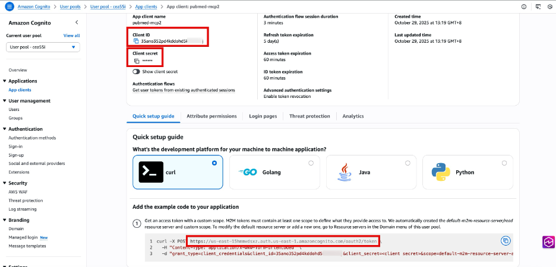

# Purpose
This fork shows how to modify an existing stdio MCP server into production level MCP server using streamable-http, and deploy it to Amazon Bedrock AgentCore.

# Prerequisite:
1. Create a Cognito User Pool with "Machine-to-machine application" type, and note down the client_id and token_endpoint. You can find the sample code to get the bearer token after created.

2. pip install bedrock_agentcore_starter_toolkit

# Steps:
1. Update the mcp(pubmed_server.py) to use fastmcp
```
from fastmcp import FastMCP
```
2. Update the mcp(pubmed_server.py) to use streamable-http:
```
mcp = FastMCP("pubmed",host="0.0.0.0", stateless_http=True)

mcp.run(transport='streamable-http')
```
3. Update and run agentcore_configure.py
Update the parameter from Cognito:
- client_id
- pool_id
```
python agentcore_configure.py
```

Your mcp server will be available at: https://bedrock-agentcore.{region}.amazonaws.com/runtimes/{encoded_arn}/invocations?qualifier=DEFAULT
- Make sure to URL-encode your agent runtime ARN when constructing the endpoint URL. The colon (:) characters become %3A and forward slashes (/) become %2F in the encoded URL.
- Add your Bearer token under authentication

# Reference
For more info on how to invoke and configure the mcp server on AgentCore, please refer to: https://docs.aws.amazon.com/bedrock-agentcore/latest/devguide/runtime-mcp.html
===

[](https://mseep.ai/app/jackkuo666-pubmed-mcp-server)

# PubMed MCP Server

[](https://smithery.ai/server/@JackKuo666/pubmed-mcp-server)

🔍 Enable AI assistants to search, access, and analyze PubMed articles through a simple MCP interface.

The PubMed MCP Server provides a bridge between AI assistants and PubMed's vast repository of biomedical literature through the Model Context Protocol (MCP). It allows AI models to search for scientific articles, access their metadata, and perform deep analysis in a programmatic way.

🤝 Contribute • 📝 Report Bug

## ✨ Core Features
- 🔎 Paper Search: Query PubMed articles with keywords or advanced search ✅
- 🚀 Efficient Retrieval: Fast access to paper metadata ✅
- 📊 Metadata Access: Retrieve detailed metadata for specific papers ✅
- 📊 Research Support: Facilitate biomedical sciences research and analysis ✅
- 📄 Paper Access: Attempt to download full-text PDF content ✅
- 🧠 Deep Analysis: Perform comprehensive analysis of papers ✅
- 📝 Research Prompts: A set of specialized prompts for paper analysis ✅

## 🚀 Quick Start

### Prerequisites

- Python 3.10+
- FastMCP library

### Installation
### Installing via Smithery

To install pubmed-mcp-server for Claude Desktop automatically via [Smithery](https://smithery.ai/server/@JackKuo666/pubmed-mcp-server):

#### claude

```bash
npx -y @smithery/cli install @JackKuo666/pubmed-mcp-server --client claude
```

#### Cursor

Paste the following into Settings → Cursor Settings → MCP → Add new server: 
- Mac/Linux  
```s
npx -y @smithery/cli@latest run @JackKuo666/pubmed-mcp-server --client cursor --config "{}" 
```
#### Windsurf
```sh
npx -y @smithery/cli@latest install @JackKuo666/pubmed-mcp-server --client windsurf --config "{}"
```
### CLine
```sh
npx -y @smithery/cli@latest install @JackKuo666/pubmed-mcp-server --client cline --config "{}"
```

1. Clone the repository:
   ```
   git clone https://github.com/JackKuo666/PubMed-MCP-Server.git
   cd PubMed-MCP-Server
   ```

2. Install the required dependencies:
   ```
   pip install -r requirements.txt
   ```

## 📊 Usage

Start the MCP server:

```bash
python pubmed_server.py
```
## Usage with Claude Desktop

Add this configuration to your `claude_desktop_config.json`:

(Mac OS)

```json
{
  "mcpServers": {
    "pubmed": {
      "command": "python",
      "args": ["-m", "pubmed-mcp-server"]
      }
  }
}
```

(Windows version):

```json
{
  "mcpServers": {
    "pubmed": {
      "command": "C:\\Users\\YOUR\\PATH\\miniconda3\\envs\\mcp_server\\python.exe",
      "args": [
        "D:\\code\\YOUR\\PATH\\PubMed-MCP-Server\\pubmed_server.py"
      ],
      "env": {},
      "disabled": false,
      "autoApprove": []
    }
  }
}
```
Using with Cline
```json
{
  "mcpServers": {
    "pubmed": {
      "command": "bash",
      "args": [
        "-c",
        "source /home/YOUR/PATH/mcp-server-pubmed/.venv/bin/activate && python /home/YOUR/PATH/pubmed-mcp-server.py"
      ],
      "env": {},
      "disabled": false,
      "autoApprove": []
    }
  }
}
```

## 🛠 MCP Tools

The PubMed MCP Server provides the following tools:

1. `search_pubmed_key_words`: Search for articles on PubMed using keywords.
2. `search_pubmed_advanced`: Perform an advanced search for articles on PubMed with multiple parameters.
3. `get_pubmed_article_metadata`: Fetch metadata for a PubMed article using its PMID.
4. `download_pubmed_pdf`: Attempt to download the full-text PDF for a PubMed article.
5. `deep_paper_analysis`: Perform a comprehensive analysis of a PubMed article.

### Searching Papers

You can ask the AI assistant to search for papers using queries like:
```
Can you search PubMed for recent papers about CRISPR?
```

### Getting Paper Details

Once you have a PMID, you can ask for more details:
```
Can you show me the metadata for the paper with PMID 12345678?
```

### Analyzing Papers

You can request a deep analysis of a paper:
```
Can you perform a deep analysis of the paper with PMID 12345678?
```

## 📁 Project Structure

- `pubmed_server.py`: The main MCP server implementation using FastMCP
- `pubmed_web_search.py`: Contains the logic for searching PubMed and retrieving article information

## 🔧 Dependencies

- Python 3.10+
- FastMCP
- asyncio
- logging
- requests
- beautifulsoup4

## 🤝 Contributing

Contributions are welcome! Please feel free to submit a Pull Request.

## 📄 License

This project is licensed under the MIT License.

## ⚠️ Disclaimer

This tool is for research purposes only. Please respect PubMed's terms of service and use this tool responsibly.
